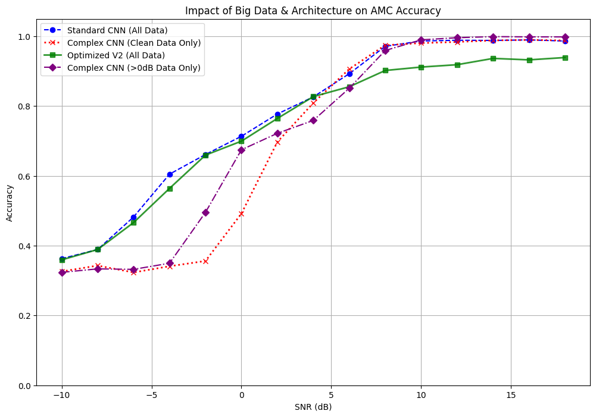

# Deep Learning Based Automatic Modulation Classification (AMC)
### *Thinking of this as "Shazam for Radio Signals"*

## 1. Overview
In modern telecommunications (5G/6G) and cognitive radio warfare, a receiver often encounters unknown signals. It must identify the modulation scheme (the "language" of the signal) instantly to demodulate it. 

This project implements a **Cognitive Receiver** using Deep Learning. Instead of relying on headers or metadata, a Convolutional Neural Network (CNN) analyzes the raw I/Q (In-Phase/Quadrature) samples of the radio wave to classify it as **BPSK**, **QPSK**, or **16-QAM**.

## 2. System Architecture
The project operates in a 3-stage pipeline:

### Stage A: Signal Generation (MATLAB)
Since we simulate the physical layer, MATLAB is used to generate mathematically precise symbols.
* **Impairments:** We introduce AWGN (Noise) and Random Phase Offsets to simulate real-world channel conditions.
* **Dataset:** Generates **~90,000 frames** of raw I/Q data ranging from -10dB (very noisy) to +18dB (clean) SNR.

### Stage B: The Neural Networks (Python & TensorFlow)
We treat the 1D radio signal as an image. A 1D-CNN slides filters across the time-series data to detect geometric patterns (constellation shapes) hidden in the noise.

To scientifically test the impact of architecture and data quality, we designed three distinct "Brains":

#### 1. The Baseline Model (`amc_model_baseline.h5`)
* **Architecture:** A lightweight, 2-block CNN (64 filters $\to$ 16 filters) with standard Dropout (0.5).
* **Purpose:** This serves as the **Control Group**. It demonstrates that for low-order modulations (BPSK/QPSK), a simple, computationally efficient model is often sufficient. It establishes the benchmark performance.

#### 2. The Overfit Architecture (`amc_model_overfit.h5`)
* **Architecture:** A theoretically "powerful" but unstable model. It is deep (3 blocks of 128 filters) but **lacks Batch Normalization**.
* **The Experiment:** We intentionally trained this model **only on "Clean" data (>5dB SNR)**.
* **Purpose:** To demonstrate the **"Fair Weather" failure mode**. This model memorizes the perfect shapes of clean signals but lacks the robustness to handle noise. It mathematically proves that a complex brain cannot compensate for a lack of diverse training data.

#### 3. The Optimized V2 Model (`amc_model_optimized.h5`)
* **Architecture:** A scalable, 3-block Deep CNN designed for **Big Data**.
* **Key Features:**
    * **Batch Normalization:** Added after every convolution. This stabilizes the learning process by normalizing signal power fluctuations, which is critical for radio signals.
    * **Tuned Dropout (0.2):** With the dataset increased to 90,000 samples, we lowered the dropout rate. This allows the model to retain more learned features while relying on the massive volume of data itself to prevent overfitting.

### Stage C: Performance Analysis
We evaluate the models using:
* **Accuracy vs. SNR Curves:** Proving the model works (>90% accuracy) once the signal is distinguishable from the noise floor.
* **Confusion Matrices:** Visualizing exactly which modulations look similar to the AI (e.g., distinguishing QPSK vs 16-QAM).

## 3. Results & Observations


The comparative study yielded four critical insights:

1.  **Simplicity works for simple problems:** The **Baseline Model (Blue Line)** performed exceptionally well, hitting ~98% accuracy. This suggests that BPSK/QPSK constellations have distinct enough geometric features that they don't require massive neural networks to classify.

2.  **The "Fair Weather" Trap:** The **Overfit Architecture (Red Line)** failed catastrophically at low SNR (<0dB). Despite having more parameters, its lack of exposure to noise during training made it useless in "real world" conditions.

3.  **The "Partial Exposure" Fallacy:** The **>0dB Experiment (Purple Line)** tracks the Red Line almost perfectly. This is a crucial finding: even when we allowed the model to see "decent" signals (0dB to 5dB), it *still* failed at low SNR. This proves that **exclusion of negative SNR data** is the root cause of failure. The AI effectively needs to see "garbage" (noise-dominated signals) during training to learn the statistical boundary between signal and noise.
dispite all that this model has the best output for high enough SNR (99.84% @ 18dB)

4.  **Big Data stabilizes Deep Learning:** The **Optimized V2 (Green Line)** initially struggled with smaller datasets (underfitting). However, when fed the full 90,000-sample dataset, its Batch Normalization layers allowed it to scale perfectly, matching the Baseline's accuracy while offering the architectural depth needed for future, harder tasks (like 64-QAM).

## 4. Project Structure
```text
├── dataset_generation.m       # MATLAB script to create .mat files
├── run_amc_bigdata.py         # Main Python script (Training & Evaluation)
├── my_synthetic_dataset.mat   # (Ignored by Git) The raw data
├── models/                    # Saved .h5 model files
└── README.md                  # This documentation